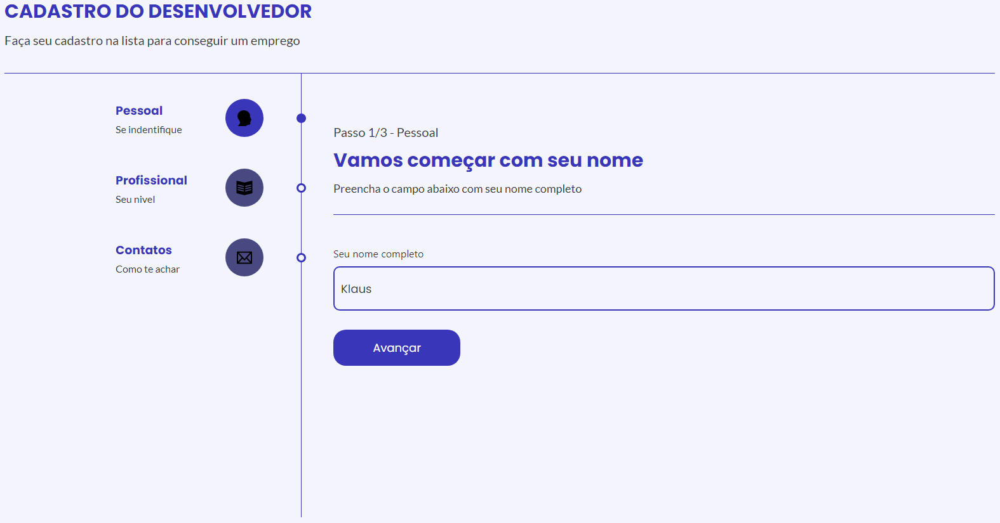

<h1 align="center">FORM MULTI ETAPAS</h1>

> 🔎 Formulário multi etapas para desenvolvedores  
🗔 Confira a aplicação: https://github.com/redlotus-dev/www-redlotus  
## :page_facing_up: Explicação
Formulário de contato para desenvolvedores feito com ReactJS utilizando recursos das bibliotecas React-Router-Dom para manipulação das rotas e ContextAPI para manipulação de dados por toda a aplicação, sua estilização é baseada em Styled Components.

O formulário é composto por 3 etapas sendo a primeira preenchimento do nome, a segunda é a escolha do seu nível como programador e a terceira campos para contato.
Além disso ele conta com validações dos campos para poder avançar as etapas, algumas delas são: Campo obrigatório, quantidade mínima de caracteres e email válido.

O objetivo do projeto foi aplicar validações e compartilhar dados utilizando ContextAPI + Reducer, mesmo sendo um formulário simples, os conhecimentos aplicados me permitem fazer a criação de literalmente qualquer tipo de formulário e validação, desde os mais simples até os mais complexos.

## 📁 Páginas

O site tem no total 4 páginas, sendo elas

- **Etapa 1:** Etapa de preenchimento do nome.

- **Etapa 2:** Etapa de seleção do seu nível como programador.

- **Etapa 3:** Conta com 2 campos para informar meios de contato.

- **Página de sucesso:** Página que informa o sucesso ao realizar cadastro.

## 🎯 Etapas ##

:heavy_check_mark: Criação das rotas do projeto.  
:heavy_check_mark: Configuração de ContextAPI com Reducer.  
:heavy_check_mark: Criação da estrutura visual do projeto.  
:heavy_check_mark: Aplicação do funcionamento e validação dos campos e rotas.  
:heavy_check_mark: Projeto finalizado.

## 🚀 Tecnologias ##

- [ReactJS](https://legacy.reactjs.org/)
- [Styled Components](https://styled-components.com/)
- [React Router](https://reactrouter.com/en/main)
- [ContextAPI](https://legacy.reactjs.org/docs/context.html)
- [Reducer](https://legacy.reactjs.org/docs/hooks-reference.html#usereducer)

## 🤝 Colaboradores

Agradecemos às seguintes pessoas que contribuíram para este projeto:

<table>
  <tr>
    <td align="center">
      <a href="#">
         
        
          <b>Klaus Morotti</b>
        
      </a>
    </td>
  </tr>
</table>

## 📝 Licença

Este projeto está sob licença. Consulte o arquivo <a href="https://github.com/klausmorotti/multi-step-form/blob/main/LICENSE">LICENSE</a> para obter mais detalhes.

<a href="#top">Volte para o topo</a>